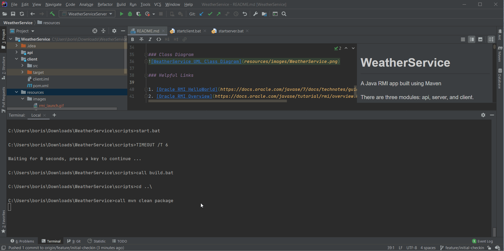
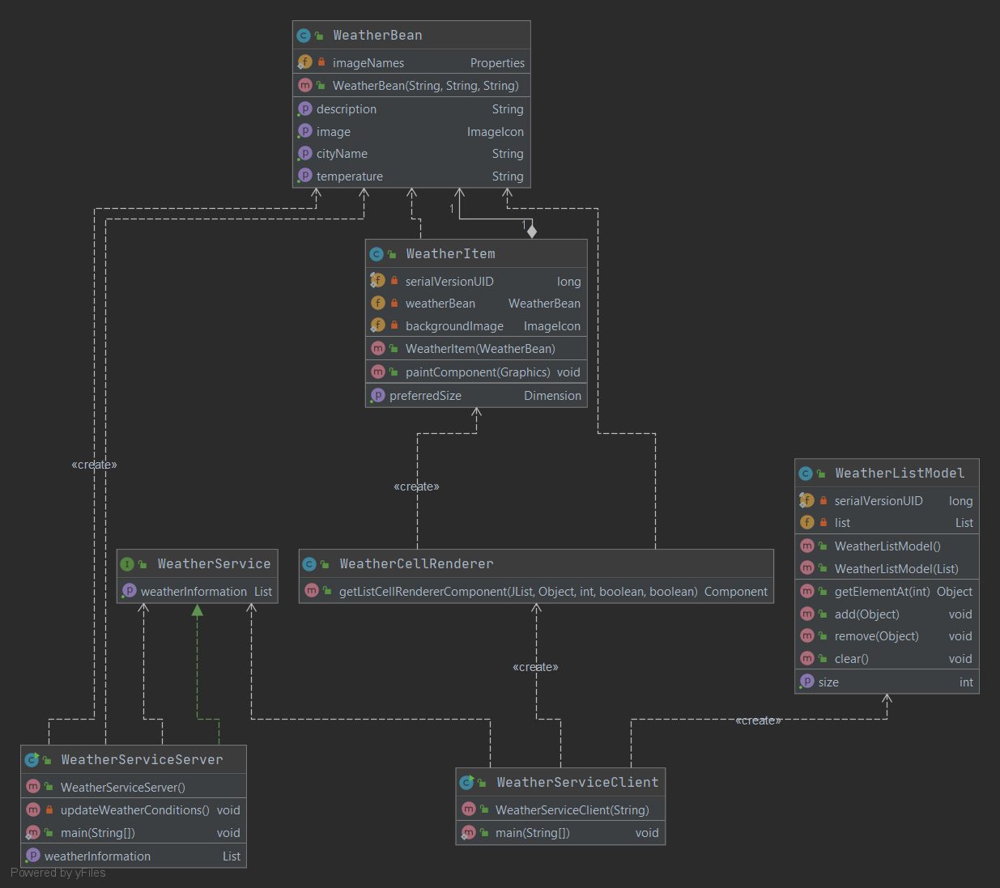
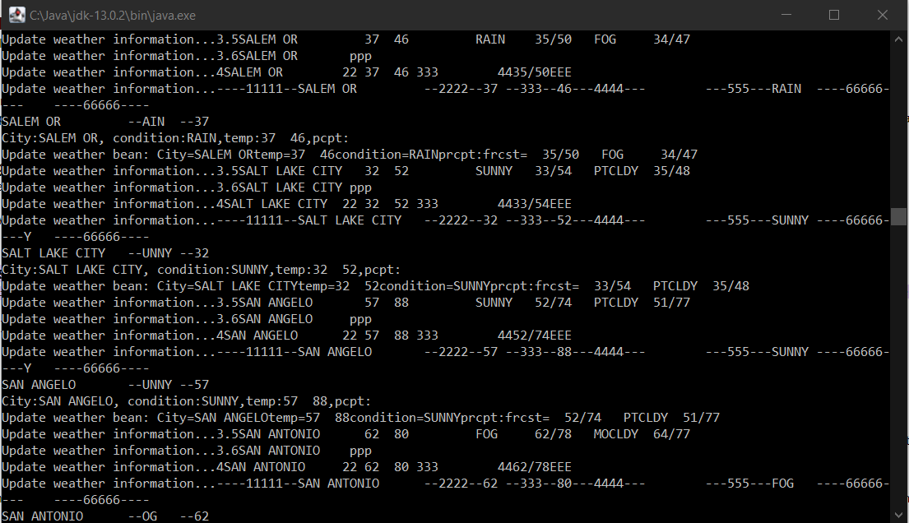

# WeatherService
A Java RMI app built using Maven

There are three modules: api, server, and client. 

- A server will be registered with the rmiregistry as "WeatherService." The server provides implementation of shared, remote methods. 
These will be invoked by the client. 
- A client will seek a registry for the server on port 1099. If no args are provided, it will use localhost, otherwise the 
first arg must be the fully qualified domain name (FQDN) of the server. The client will invoke remote methods. 
- The api contains a WeatherService, which is a remote interface UnicastRemoteObject. It provides declarations for remote methods. 

When a server creates a new WeatherBean, the second argument weatherDescription is used to look up the image. The resource file imagenames.properties 
contains a list of key-value properties, which are loaded in a static initialization block in WeatherBean. 

## Script Automation
#### Build and run
```
cd scripts
start.bat (windows)
start.sh (linux)
```



## Build manually
From project root: 
```
mvn clean package
cp -r api/target/classes/* server/target/classes/
cp -r client/target/classes/* server/target/classes/
rmiregistry -J-Djava.rmi.server.useCodebaseOnly=false
java -Djava.rmi.server.useCodebaseOnly=false \
 -Djava.rmi.server.codebase=file:/path/to/classes/ \
 -Djava.security.policy=/path/to/server.policy \
 edu.txstate.bss64.weatherserver.WeatherServiceServer
java -Djava.rmi.server.useCodebaseOnly=false \
 -Djava.rmi.server.codebase=file:/path/to/classes/ \
 -Djava.security.policy=/path/to/server.policy \
 edu.txstate.bss64.weatherclient.WeatherServiceClient
```
Ensure there is a final back or forward slash (depenidng on your OS)
at the end of the path to the classfiles for rmi.server.codebase.

### Class Diagram


### Weather Data

The application procures data from:     
https://forecast.weather.gov/product.php?site=CRH&product=SCS&issuedby=01    
It changes the last digit in the URL from one to four. 

When data is received (in HTML format) and parsed, a cmd window will display:


### Helpful Links

1. [Oracle RMI HelloWorld](https://docs.oracle.com/javase/7/docs/technotes/guides/rmi/hello/hello-world.html)
2. [Oracle RMI Overview](https://docs.oracle.com/javase/tutorial/rmi/overview.html)